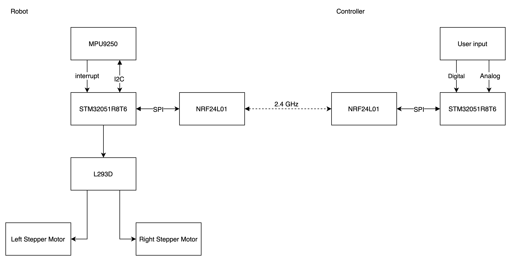

# Adjustic

This is the git repository for the Spring 2020 ECE 362 mini project.  

A self-balanced two wheel robot using:

* STM32F051R8T6
* Sensor
  * [MPU9250](https://invensense.tdk.com/products/motion-tracking/9-axis/mpu-9250/) Nine-Axis acclerator, gyroscope, and compass
    * [Ardiuno example](https://learn.sparkfun.com/tutorials/mpu-9250-hookup-guide)
      * include conversion from quaternion to euler's angle
    * [MPU9250.h](https://github.com/kriswiner/MPU9250/blob/master/STM32F401/MPU9250.h)
      * Include register map
      * Include calculation of quaternion
    * [Sparkfun MPU9250 DMP](https://github.com/sparkfun/SparkFun_MPU-9250-DMP_Arduino_Library)
    * [Datasheet](https://invensense.tdk.com/wp-content/uploads/2015/02/PS-MPU-9250A-01-v1.1.pdf)
    * [Register map](https://cdn.sparkfun.com/assets/learn_tutorials/5/5/0/MPU-9250-Register-Map.pdf)
    * [MPU9250 App notes](https://gzuliani.bitbucket.io/arduino/files/arduino-mpu6050/invensense-hardware-offset-registers.pdf)
    * Invensense has portable driver library with small amount of modification
      * Navigate to their download page for more information
  * [BNO055](https://ae-bst.resource.bosch.com/media/_tech/media/datasheets/BST-BNO055-DS000.pdf)
    * output angles directly
* Stepper Motor driver
  * [L293D](https://www.st.com/en/motor-drivers/l293d.html) Four channel motor driver
  * or [A4988](https://www.pololu.com/file/0J450/A4988.pdf) Stepper motor driver
* Stepper motors
  * [28BYJ-48](https://www.adafruit.com/product/858?gclid=CjwKCAiA44LzBRB-EiwA-jJipFIlivX6OHOKTyI2wocbWYVngoLbgBn7D_prLMaMkDIHmaRfBtIohhoCGWQQAvD_BwE) 5V 4 Phase DC Gear Stepper motor 15 N·cm
* [NRF24L01](https://www.sparkfun.com/datasheets/Components/nRF24L01_prelim_prod_spec_1_2.pdf) 2.4GHz Transceiver

Project Architecture

## Objective

1. [ ] Two wheel self-balanced within +3/-3 deg
   1. [ ] PID controller
   2. [ ] Angle/angular speed sensor interface
   3. [ ] Driving chassis interface
      1. [ ] Generic stepper motor interface
      2. [ ] L293D interface
   4. [ ] Logging library
      1. Logging level
         * `NONE`: Nothing gets logged
         * `ERROR`: Only errors get logged
         * `WARNING`: Errors and warning get logged
         * `DEBUG`: More debugging related messages get logged
         * `INFO`: Log everything
      2. [ ] Error message and signal interface (buzzer, Leds)
      3. [ ] UART serial debug message output
         1. Only included in debug version of code
2. [ ] Remote control via another STM32051R8T6 along with NRF24L01
   1. [ ] Transimitter/Receiver generic communication interface
      1. wrapper for various kind of SPI transimission device
   2. [ ] Communication packet struct definition
   3. [ ] NRF24L01 interface
   4. [ ] User input panel
      1. [ ] Digital button input
      2. [ ] Analog joystick input

## Materials to Learn

* DMA
  * For automatically loading data from sensors and peripherals to memory
  * Textbook chapter 19
* I2C Protocol
  * For communication with acclerator and gyroscope (MPU 9250)
  * Textbook chapter 22.2
* Stepper Motor control
  * Textbook chapter 16
* PID Controller
  * [wiki page](https://en.wikipedia.org/wiki/PID_controller)
* SPI Protocol
  * For wireless controller
  * Textbook chapter 22.3
* [git operation](./docs/git_intro.md)
* [Stdperiph Lib](https://www.st.com/content/ccc/resource/technical/document/user_manual/59/2d/ab/ad/f8/29/49/d6/DM00023896.pdf/files/DM00023896.pdf/jcr:content/translations/en.DM00023896.pdf)
  * Or browse through the `src` and `inc` folders under folder `StdPeriph_Driver`
  * You can hold `cmd` while clicking the function name, type, or variable to search for its definition.

## Before Coding/Building

### MPU9250 Library Path Configuration

We will be using the MPU9250 library provided by the company Invensense to configure the MPU9250 chip and the DMP as well as API to interface with the IMU.

To do so, make sure you have correctly import the project into your SystemWorkbench. The configuration file `.cproject` should automatically add the following include path. If not, you will need to add the following path to the project include path configuration (`Project->Properties->C/C++ Build->Settings->GCC Compiler setting include`)

    "${ProjDirPath}/MPU9250_Driver/driver/include"
    "${ProjDirPath}/MPU9250_Driver/driver/eMPL"
    "${ProjDirPath}/MPU9250_Driver/driver/stm32L"
    "${ProjDirPath}/MPU9250_Driver/eMPL-hal"
    "${ProjDirPath}/MPU9250_Driver/mllite"
    "${ProjDirPath}/MPU9250_Driver/mpl"

In addition, you will also need to include the symbol `MPU9250` while compiling for both debug and release configuration. Again, this should be handled automatically by properly importing the project. If not, plesae add symbol `MPU9250` to your compiler preprocessor setting (`Project->Properties->C/C++ Build->Settings->GCC Compiler setting preprocessor`). Or you can pass the flag `-D MPU9250` while using the compiler.

### Autocomplete functionality

Please please use the autocomplete on Eclipse. It saves both time and programmers' life. You can configure the shortcut key in `Preference` and search for `key` and in the shortcut mapping page, search for `content assist` (weird name BTW).

## Collaboration Process Explanation

### Terminology

1. `dev` branch: hosts new features to be added to the project
2. `master` branch: stable software release
3. `pull request`: change by other collaborator to the branch
   1. [ref](https://help.github.com/en/github/collaborating-with-issues-and-pull-requests/about-pull-requests)
4. Collaborator: developers working in this project

### Development process

1. All developing work will be conducted on `dev` branch
   1. Modules/Features developing should be kept as local branches prior to integrate them to `dev` branch
   2. Collaborators are expected to **test their modules/features** prior to submit a pull-request
2. After **throughout** testing
   1. Collaborator can submit a pull-request to the `master` branch
   2. Other personnel should examine the submitted code throughly prior to approve the pull-request (code review)

## Coding Standard

Below are the coding standards for this project. Pull-request not following these will be rejected and advised to change.

### General coding

* Naming
  * Variables and function naming must follow camelCase naming format
    * `void getChar(int tmp);`
    * `int isError = 0;`
  * Constants need be capitalized and connected via underline `_`
    * e.g. `MAX_BUFF_SIZE`
  * Variable or constant naming must be meaningful
    * **NO** single letter naming unless as temporary variable in loop
      * ❌`int a = 0;`  
      * ✅`for (int i = 0; i < 10; i++);`
    * Naming variable as `tmp` are allowed if the variable serves only as
      * place to temperarily hold exchanged value like in swapping two integer
      * value to be discarded / not used in current naming scope
    * Preferably variable with the same or similar purpose should have close name
      * Example
  
            int sensorXAccel;
            int sensorYAccel;
      * However, consider the following two questions prior to create this type of variables
        * Can I use array to represent them?
        * Can I define a struct to hold them?
* Branching
  * Space follow branching keywords (`if`, `while`, or `for`, etc.)
  * Left curly parantheses on the same line of the branching keywordds
  * Example

        if (flag == 0) {
          // do something
        }
* Miscellaneous
  * Space around every equal sign or comparison symbol
    * `int i = 1;` rather than `int i=0;`
    * `if (a > 0)` rather than `if (a>0)`
  * Header file
    * While creating a new header file, use the [C header guard](https://www.learncpp.com/cpp-tutorial/header-guards/) as follows (for a header file named `stepper.h`)

          #ifndef __STEPPER_H__
          #define __STEPPER_H__

          // Put function declaration
          // Put constants
          // here

          #endif

### Debug, Release, and Logging

* Debug configuration code block
  * In eclipse, the IDE will pass a c `#define DEBUG` directive in debug configuration when build for debug and not for release
  * Therefore, it is wise to use this to limit some of the logging code to debug mode only using the following structure

        // Debug block
        #ifdef

        // Code only gets to source code in debug build setting
        
        #else

        // Optional branch which will get in to source code in release build setting
         
        #endif

* Function implementation
  * Use logging library `assert` to validate inputs
  * and output error message (should be handled by logging library automatically)

### Comment specification

An eclipse snippet template has been exported and can be downloaded [here](./docs/eclipse-templates.xml). You will need to import it to your eclipse workbench to use the keywords to invoke them.

Header comment (keyword: `header`)

    /************************************************************
    *
    * @file:      FILE_NAME
    * @author:    YOUR_NAME
    * @email:     YOUR_EMAIL
    * @version:   VERISON_NUMBER (e.g. v1.0.0)
    * @date:      DATE
    * @brief:     Short explanation of the file
    *
    ************************************************************/

Function docstring (keyword: `docstring`)

    /************************************************************
    * 
    * Function: FUNCTION_NAME
    * @brief:   what does the fuction do
    * @param:   function parameter name, type, and short explanation
    * @return:  function return name, type, and short explanation
    * 
    ************************************************************/

Block comment (keyword: `comment`) to indicate the purpose of a large section of code

    /************************************************************
    * COMMENTS
    ************************************************************/

Multi-line comment to comment over a few lines

    /*
     * Comment goes here
     */

## TODO

* [x] Project proposal
* [ ] Robot component and subsystem architecture design
  * Protocols
  * Interrupts selection
  * Communication Packet design
    * specify the distance the robot need to move
    * or the speed
    * speed should have higher priority
    * UART command should have higher priority then SPI
  * Library design / Program Diagram
    * Stepper control library
      * Generic?
        * for other chip as well
      * angular speed control
      * angle control
      * use configuration struct to parameterize the function
      * maintain a global config struct for the functions to use?
    * Generical wrapper sensor library
      * general interface for other accelerator, gyroscope, or compass
    * MPU 9250 interface Library
  * Detailed Program Flowchart/outline
  * Rough mechanical design
    * Rough specification for motors and wheel
    * Basic structural design for robot
* [ ] Develop schedule and task assignment
* [ ] Project Development
  * [ ] Add MPU9250 driver to project folder and create test file
