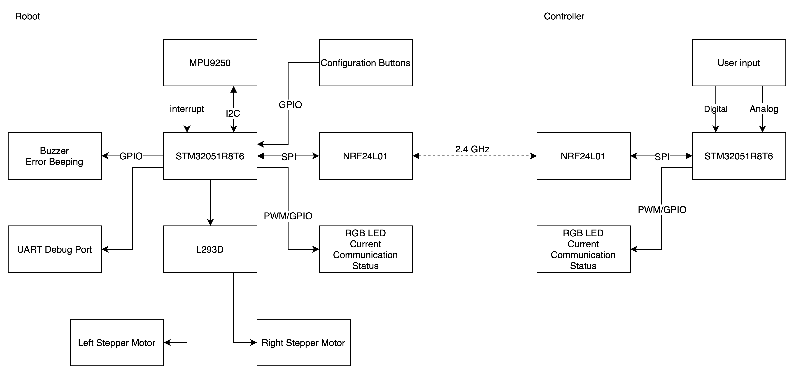

# Adjustic

This is the git repository for the Spring 2020 ECE 362 mini project.  

A self-balanced two wheel robot using:

* STM32F051R8T6
* [MPU9250](https://invensense.tdk.com/products/motion-tracking/9-axis/mpu-9250/) Nine-Axis acclerator, gyroscope, and compass
* [L293D](https://www.st.com/en/motor-drivers/l293d.html) Four channel motor driver
* Stepper motors
* [NRF24L01](https://www.sparkfun.com/datasheets/Components/nRF24L01_prelim_prod_spec_1_2.pdf) 2.4GHz Transceiver

Project Architecture

## Components

## Materials to Learn

* DMA
  * For automatically loading data from sensors and peripherals to memory
  * Textbook chapter 19
* I2C Protocol
  * For communication with acclerator and gyroscope (MPU 9250)
  * Textbook chapter 22.2
* Stepper Motor control
  * Textbook chapter 16
* PID Controller
  * [wiki page](https://en.wikipedia.org/wiki/PID_controller)
* SPI Protocol
  * For wireless controller
  * Textbook chapter 22.3
* [git operation](./docs/git_intro.md)

## Collaboration Process Explanation

### Terminology

1. `dev` branch: hosts new features to be added to the project
2. `master` branch: stable software release
3. `pull request`: change by other collaborator to the branch
   1. [ref](https://help.github.com/en/github/collaborating-with-issues-and-pull-requests/about-pull-requests)
4. Collaborator: developers working in this project

### Development process

1. All developing work will be conducted on `dev` branch
   1. Modules/Features developing should be kept as local branches prior to integrate them to `dev` branch
   2. Collaborators are expected to **test their modules/features** prior to submit a pull-request
2. After **throughout** testing
   1. Collaborator can submit a pull-request to the `master` branch
   2. Other personnel should examine the submitted code throughly prior to approve the pull-request (code review)

## TODO

* [ ] Robot component and subsystem architecture design
  * Protocols
  * Interrupts selection
  * Communication Packet design
  * Detailed Program Flowchart/outline
* [ ] Develop schedule and task assignment
